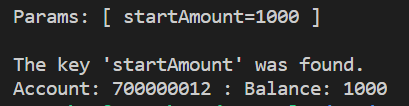
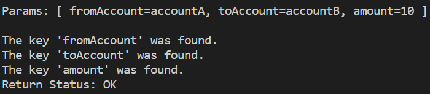
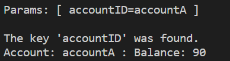
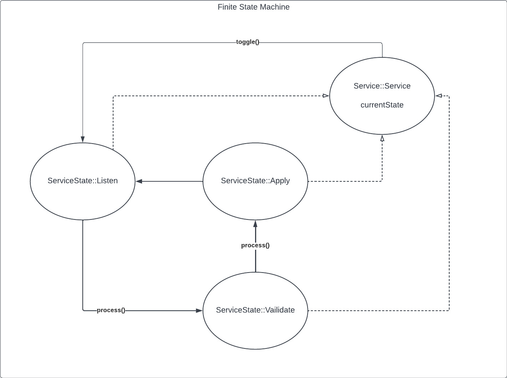

# digital-wallet  
C++ backend wallet service. This is a backend service that provides high volume REST-like API functions to client processes. It accounts for transactions based on a defined value and a generated account ID. It is meant to be a stand alone service were multiple instances can be managed by an orchestrator in the future.

Example Execution:  
```
curl -X GET "localhost:18080/api/1.0/wallet/create_account?startAmount=1000"
```
 

```
curl -X GET "http://localhost:18080/api/1.0/wallet/balance_transfer?fromAccount=accountA&toAccount=accountB&amount=10"
```
  

```
curl -X GET "http://localhost:18080/api/1.0/wallet/get_balance?accountID=accountA"
```
 

## Prereqs  
Base source  
```
sudo apt-get install libc6-dev g++ libboost-all-dev cmake
```
Rocksdb Integration  
see install guide for reference https://github.com/facebook/rocksdb/blob/main/INSTALL.md  
```
sudo apt-get install libsnappy-dev libbz2-dev
```  

## Build  
```
mkdir build  
```
```
cd build  
```
```
git clone https://github.com/facebook/rocksdb.git
```
```
cd rocksdb
```
```
make static_lib
```
```
mv librocksdb.a ..
```
```
cd .. & cmake ..  
```
```
make  
```

### Alternative Build  
Using the RockDB integration  
```
 g++ --std=c++17 -o wallet-service ../src/ConcreteServiceState.cpp ../src/Service.cpp ../src/main.cpp -L. -lrocksdb -lsnappy -lpthread -lbz2 -lz -lrt -ldl -lboost_serialization
```
## Integrations  
using crow c++ API (https://github.com/CrowCpp/Crow)  
using boost.io for mmapped command and event files  
using rocksdb for key-value store of account and balences

## Design





## C++ and OOP features
#### Files to Review  
Command.hpp
ConcreteServiceState.cpp
ConcreteServiceState.h
Event.hpp
main.cpp
Service.cpp
Service.h
ServiceState.h

#### Loops, Functions, I/O  
The project demonstrates an understanding of C++ functions and control structures. 
The project accepts user input and processes the input.  
The project reads data from an external file or writes data to a file as part of the necessary operation of the program.  


#### Object Oriented Programming  
The project code is organized into classes with class attributes to hold the data, and class methods to perform tasks.  
All class data members are explicitly specified as public, protected, or private.  
Class constructors utilize member initialization lists.  
Classes abstract implementation details from their interfaces.  
Derived class functions override virtual base class functions.  


#### Memory Management  
The project makes use of references in function declarations.  
At least two variables are defined as references, or two functions use pass-by-reference in the project code.  
The project uses destructors appropriately.  
The project uses move semantics to move data, instead of copying it, where possible.  


#### Concurrency  
A mutex or lock (e.g. std::lock_guard or `std::unique_lock) is used to protect data that is shared across multiple threads in the project code.  
A std::condition_variable is used in the project code to synchronize thread execution.  
