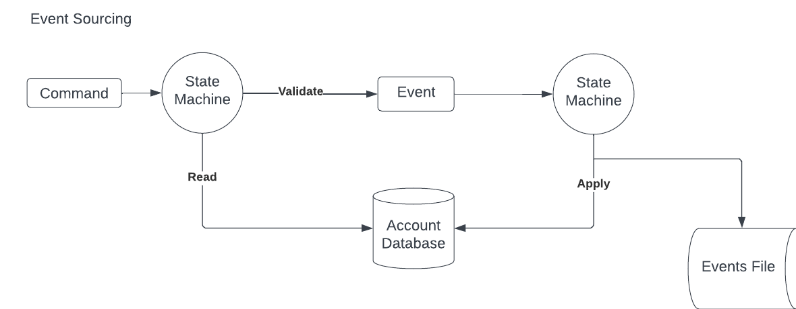
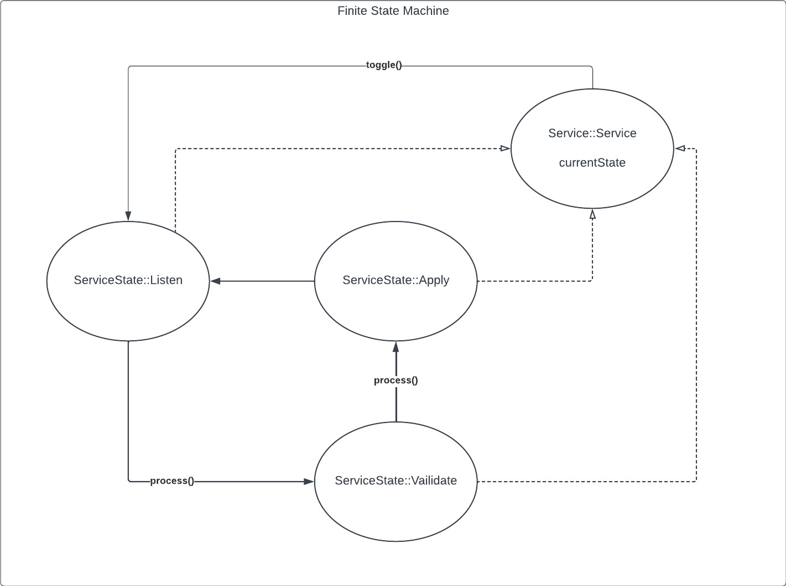

# Digital Wallet Service

A C++ backend service that processes high-volume financial transactions through a REST API. Built with an **event sourcing** architecture and a **state machine** pattern to ensure atomic command processing.

## Architecture

The service processes balance transfers through a three-phase state machine:

```
LISTEN  -->  VALIDATE  -->  APPLY  -->  LISTEN
  |              |
  |         (invalid) --> back to LISTEN
  |
  waits for commands on a thread-safe message queue
```

- **LISTEN** &mdash; Waits for incoming commands; notifies callers when ready
- **VALIDATE** &mdash; Verifies both accounts exist and the sender has sufficient funds
- **APPLY** &mdash; Debits/credits accounts atomically in RocksDB and appends to the event log

### Key Design Decisions

| Concern | Approach |
|---------|----------|
| Persistence | RocksDB key-value store for account balances |
| Atomicity | State machine ensures validate-then-apply ordering |
| Concurrency | Thread-safe `MessageQueue<T>` with condition variables |
| Audit trail | Event sourcing &mdash; every transfer produces immutable debit/credit events |
| IDs | UUID generation via Boost for transaction tracking |

### System Diagram




## Tech Stack

- **C++17** &mdash; Core language
- **[Crow](https://github.com/CrowCpp/Crow)** &mdash; HTTP/REST framework
- **[RocksDB](https://github.com/facebook/rocksdb)** &mdash; Embedded key-value store
- **Boost** &mdash; UUID generation, serialization, filesystem
- **CMake** &mdash; Build system

## API

| Endpoint | Method | Description |
|----------|--------|-------------|
| `/api/1.0/wallet/create_account?startAmount=N` | GET | Create a new account with starting balance |
| `/api/1.0/wallet/balance_transfer?fromAccount=A&toAccount=B&amount=N` | GET | Transfer funds between accounts |
| `/api/1.0/wallet/get_balance?accountID=A` | GET | Query an account balance |
| `/api/1.0/wallet/events` | GET | Read the event log |

### Example Usage

```bash
# Create an account with 1000 starting balance
curl "localhost:18080/api/1.0/wallet/create_account?startAmount=1000"

# Transfer 50 from accountA to accountB
curl "localhost:18080/api/1.0/wallet/balance_transfer?fromAccount=accountA&toAccount=accountB&amount=50"

# Check balance
curl "localhost:18080/api/1.0/wallet/get_balance?accountID=accountA"
```

## Prerequisites

```bash
sudo apt-get install libc6-dev g++ libboost-all-dev cmake
sudo apt-get install libsnappy-dev libbz2-dev
```

RocksDB: see the [install guide](https://github.com/facebook/rocksdb/blob/main/INSTALL.md) for reference.

## Build

```bash
mkdir build && cd build
git clone https://github.com/facebook/rocksdb.git
cd rocksdb && make static_lib
mv librocksdb.a ..
cd .. && cmake .. && make
```

### Alternative (direct compilation)

```bash
g++ --std=c++17 -o wallet-service \
  src/ConcreteServiceState.cpp src/Service.cpp src/main.cpp \
  -L. -lrocksdb -lsnappy -lpthread -lbz2 -lz -lrt -ldl -lboost_serialization
```

## Run

```bash
./wallet-service
# Service starts on port 18080
```

## Project Structure

```
src/
  main.cpp                 # Entry point, REST endpoint handlers
  Service.h/cpp            # Core service orchestrator, RocksDB init
  ServiceState.h           # Abstract state interface
  ConcreteServiceState.h/cpp  # LISTEN / VALIDATE / APPLY implementations
  Command.hpp              # Transfer command model with UUID generation
  Event.hpp                # Immutable event model with serialization
  MessageQueue.h           # Thread-safe generic message queue
lib/
  rocksdb/                 # RocksDB headers
  crowapi/                 # Crow HTTP framework headers
```

## License

[MIT](LICENSE)
